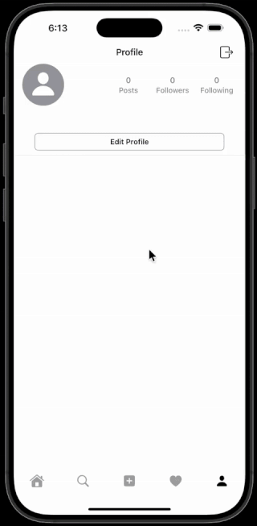
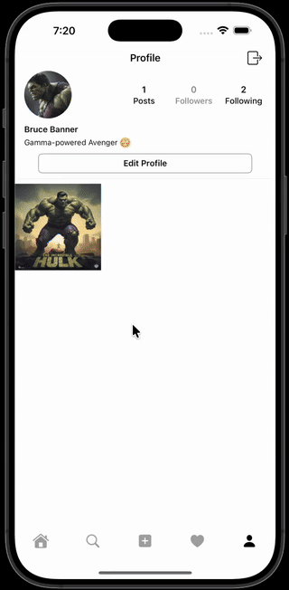

# Instagram Clone

A full-featured Instagram clone iOS app built with **SwiftUI** and **Firebase**, demonstrating production-ready iOS development skills.

[](https://swift.org)
[](https://developer.apple.com/xcode/swiftui/)
[](https://firebase.google.com)
[](https://developer.apple.com/ios/)
[](LICENSE)

---

## 📱 Demo

| 🔐 User Authentication | ✏️ Profile Management |
|:---:|:---:|
|  |  |
| *Complete user registration flow with email verification, username creation, and password setup* | *Profile editing interface with bio updates, profile picture changes, and user information management* |

| ❤️ Social Interactions & Notifications |
|:---:|
|  |
| *Real-time social features including follow/unfollow, like/unlike, commenting, and comprehensive notification system* |

---

*All demos showcase the smooth, production-ready user experience with real-time updates and intuitive interactions*

---

## 🎯 Project Overview

This project is a **production-quality Instagram clone** designed to demonstrate advanced iOS development skills using modern SwiftUI patterns and Firebase backend services. As a self-taught developer, this project showcases my ability to build complex, scalable applications with clean architecture and best practices.

### 🏆 Key Technical Achievements
- **MVVM Architecture**: Clean separation of concerns with dedicated ViewModels
- **Real-time Data Sync**: Firebase Firestore integration with live updates
- **Advanced SwiftUI Patterns**: `@StateObject`, `@EnvironmentObject`, custom bindings
- **Image Optimization**: Efficient image caching and upload with Kingfisher
- **State Management**: Sophisticated view lifecycle handling with dynamic resets
- **Authentication Flow**: Complete user registration/login with Firebase Auth

---

## ✨ Core Features

### 🔐 Authentication & User Management
- **Firebase Authentication**: Secure sign up, login, and session management
- **Multi-step Registration**: Email verification, username creation, password setup
- **Profile Management**: Edit profile information, bio, and profile pictures

### 📱 Social Features
- **Feed System**: Infinite scroll with image caching and lazy loading
- **Post Creation**: Photo picker integration with caption support
- **Like System**: Real-time like/unlike functionality
- **User Search**: Live search with debounced input and filtering
- **Follow System**: Follow/unfollow users with real-time updates

### 🔔 Notifications & Interactions
- **Activity Feed**: Comprehensive notification history and management
- **Interactive Elements**: Like, comment, and follow notifications

### 🎨 Advanced UI/UX
- **Responsive Design**: Adaptive layouts for different screen sizes
- **Smooth Animations**: Custom transitions and micro-interactions
- **Tab Navigation**: State-aware navigation with view resets
- **Image Optimization**: Efficient image loading with placeholder states

---

## 🛠️ Technology Stack

### Frontend
- **SwiftUI 5.0** — Declarative UI framework with advanced state management
- **Combine** — Reactive programming for data binding
- **PhotosUI** — Native photo picker with privacy-first approach

### Backend & Services
- **Firebase Authentication** — Secure user authentication and session management
- **Firebase Firestore** — NoSQL database with real-time synchronization
- **Firebase Storage** — Scalable image and file storage

### Third-Party Libraries
- **Kingfisher** — Efficient image downloading, caching, and processing
- **Firebase iOS SDK** — Official Firebase SDK for iOS

### Development Tools
- **Xcode 15** — Latest iOS development environment
- **Swift Package Manager** — Dependency management
- **iOS 17.0+** — Modern iOS features and APIs

---

## 🏛️ Architecture & Design Patterns

### MVVM Architecture
```
Views (SwiftUI) ↔ ViewModels (Business Logic) ↔ Services (Data Layer)
```

### Key Design Patterns Implemented:
- **Observer Pattern**: `@StateObject` and `@Published` for reactive UI updates
- **Factory Pattern**: Service layer abstraction for data operations
- **Repository Pattern**: Centralized data access through service classes
- **Dependency Injection**: Environment objects for shared state management

### State Management Strategy:
- **Local State**: `@State` for view-specific data
- **Shared State**: `@StateObject` for view model lifecycle
- **Global State**: `@EnvironmentObject` for app-wide data
- **View Resets**: Dynamic `.id()` modifiers to prevent stale state

---

## 🚀 Getting Started

### Prerequisites
- Xcode 15.0 or later
- iOS 17.0+ deployment target
- Firebase project setup
- Apple Developer Account (for device testing)

### Installation Steps

1. **Clone the repository**
   ```bash
   git clone https://github.com/m-rabbi/Instagram.git
   cd Instagram
   ```

2. **Open in Xcode**
   ```bash
   open Instagram.xcodeproj
   ```

3. **Install Dependencies**
   - Dependencies are managed via Swift Package Manager
   - Xcode will automatically resolve packages on first build

4. **Configure Firebase**
   - Create a Firebase project at [console.firebase.google.com](https://console.firebase.google.com)
   - Download `GoogleService-Info.plist` and add to project
   - Enable Authentication, Firestore, and Storage services

5. **Build and Run**
   - Select your target device or simulator
   - Press `Cmd + R` to build and run

### Firebase Configuration
```swift
// Firebase configuration is handled in InstagramApp.swift
class AppDelegate: NSObject, UIApplicationDelegate {
    func application(_ application: UIApplication,
                     didFinishLaunchingWithOptions launchOptions: [UIApplication.LaunchOptionsKey : Any]? = nil) -> Bool {
        FirebaseApp.configure()
        return true
    }
}
```

---

## 📖 User Guide

### Getting Started
1. **Launch the app** and create a new account or sign in
2. **Complete registration** by adding email, username, and password
3. **Upload a profile picture** and add your bio

### Core Features
- **Feed**: Scroll through posts, like, and interact with content
- **Search**: Discover new users and content with live search
- **Upload**: Tap the + button to create new posts with photos and captions
- **Notifications**: Stay updated with likes, comments, and follows
- **Profile**: View and edit your profile, see your posts grid

### Advanced Features
- **Real-time Updates**: All interactions update instantly across devices
- **Image Caching**: Fast loading with intelligent image caching
- **Offline Support**: Basic offline functionality with local state

---

## 🔧 Development Insights

### Code Quality Practices
- **Consistent Naming**: Clear, descriptive variable and function names
- **Modular Architecture**: Reusable components and services
- **Performance**: Efficient data fetching and UI updates
- **Error Handling**: Comprehensive error states and user feedback

### Performance Optimizations
- **Lazy Loading**: Images and content loaded on-demand
- **Memory Management**: Efficient image caching and cleanup
- **Network Optimization**: Minimal API calls with smart caching

---

## 🚀 Roadmap

### Planned Features
- [ ] **Direct Messaging**: Real-time chat functionality
- [ ] **Stories**: Instagram-style story creation and viewing
- [ ] **Video Support**: Video upload and playback
- [ ] **Advanced Filters**: Photo editing and filters
- [ ] **Dark Mode**: Complete dark mode support
- [ ] **Push Notifications**: Rich push notifications with actions

### Technical Improvements
- [ ] **Unit Tests**: Comprehensive test coverage
- [ ] **UI Tests**: Automated UI testing
- [ ] **Performance Monitoring**: Firebase Performance integration
- [ ] **Analytics**: User behavior tracking
- [ ] **CI/CD**: Automated build and deployment pipeline

---

## 👨‍💻 About the Developer

**Md Rabbi** is a passionate, self-taught iOS developer with a strong focus on modern SwiftUI development and Firebase integration. This project demonstrates my ability to:

- **Build Production Apps**: Scalable architecture with real-world complexity
- **Master Modern iOS**: SwiftUI, Combine, and latest iOS features
- **Integrate Backend Services**: Firebase ecosystem expertise
- **Solve Complex Problems**: Analytical thinking and technical problem-solving
- **Write Clean Code**: Maintainable, well-documented codebase

### Skills Demonstrated
- **SwiftUI & Combine**: Advanced state management and reactive programming
- **Firebase**: Authentication, Firestore, Storage, and real-time features
- **iOS Development**: Native iOS development with latest frameworks
- **UI/UX Design**: Clean, intuitive user interfaces
- **Architecture**: MVVM, dependency injection, and modular design

---

## 📄 License

This project is licensed under the MIT License - see the [LICENSE](LICENSE) file for details.

---

## 🤝 Contributing

While this is primarily a portfolio project, I welcome feedback and suggestions for improvements. Feel free to:

- Open issues for bugs or feature requests
- Submit pull requests for improvements
- Connect with me on [LinkedIn](https://linkedin.com) or [GitHub](https://github.com/m-rabbi)

---

**Built with ❤️ using SwiftUI and Firebase**
